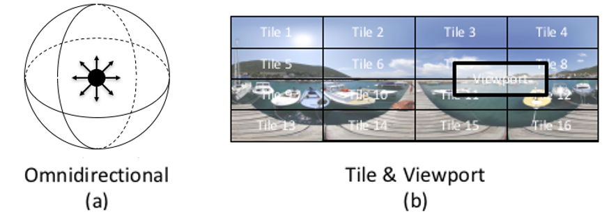
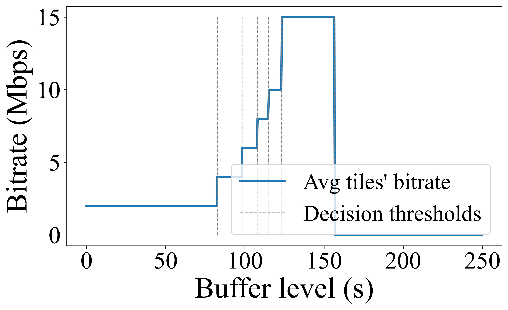
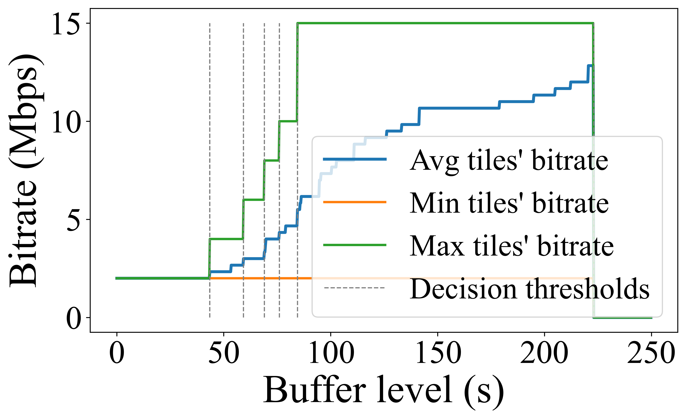
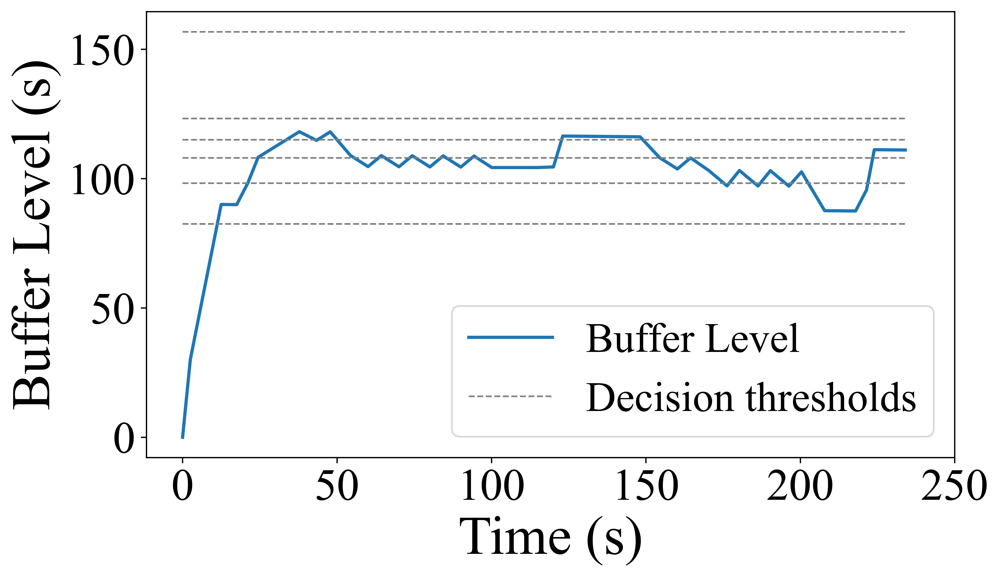
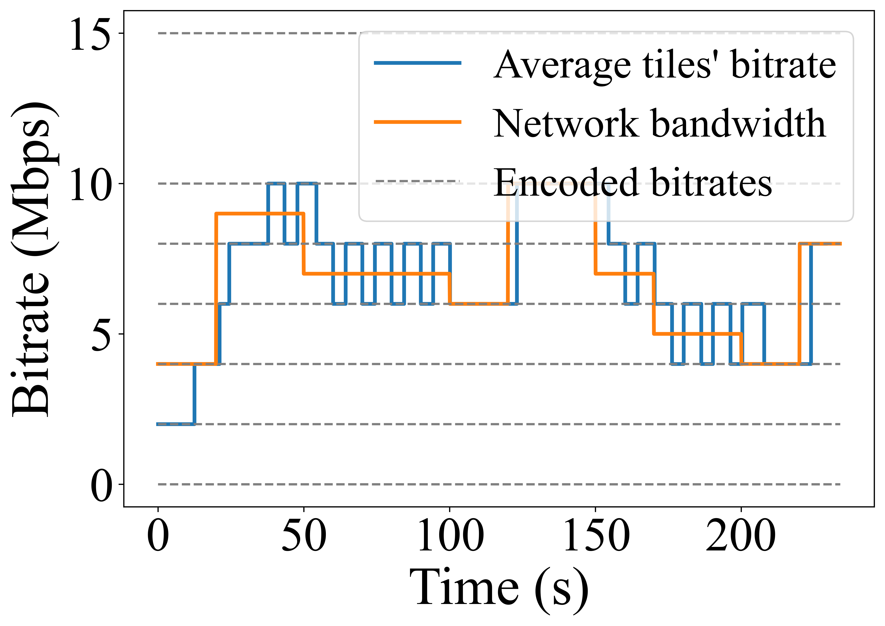

# VSE360

This repository houses a comprehensive Python environment dedicated to the simulation of 360-degree video streaming and evaluation of various state-of-the-art (SOTA) algorithms. 
Features
- SOTA Algorithm Implementations: Contains implementations of cutting-edge algorithms used for online 360-degree video streaming evaluation.
- User's Head Direction Simulator: A simulator enabling the emulation of user head-direction changes during video streaming sessions.
- Network Emulator: Tool to simulate varying network conditions such as latency, bandwidth, and packet loss.
- Buffer Implementation: Buffer management system to simulate and evaluate video buffering scenarios.

<p align="center">

</p>

## Tiled 360-degree video Streaming
The 360-degree videos are stored in servers and delivered to the users in an online fashion. The video delivery approach is to divide the entire 360-degree video into same duration chunks of length. Then, each chunk is spatially split into a set of tiles to fully cover the viewing sphere of the user. Each tile is encoded in multiple bitrates (i.e., resolutions). Video tiles are streamed ahead of time and buffered at the client before they can be rendered to the user. As the user changes their viewport, say by moving their head, the appropriate tiles within the user's  FOV  is extracted from the client's buffer and rendered on the user's display.

<p align="center">

</p>

## BOLA360: Near-optimal View and Bitrate Adaptation for 360-degree Video Streaming 
This repository is implemented under [BOLA360](https://arxiv.org/pdf/2309.04023.pdf) project.
BOLA360 is a near optimal ABR algorithm for 360-degree video streaming. Implementation of BOLA360 and two of its heuristic improved versions is alsow provided in this environment.

<p align="center">


</p>

<p align="center">


</p>


## Algorithms
We have implemented SOTA algorithm in this environment for your evaluations. You don't need to that again :)
The implemented algorithms include:
- BOLA360
- Pano
- Flare
- 360ProbDash
- View-port Aware
- Mosaic
- Greedy Algorithm
- Naive Algorithm

## Implementation of your algorithm
Create a class for your algorithm and implement it based on algorithm design and constraints. Your class must include below functions:
``` 
get_action(self, params*) // returns array of size = _number_of_tiles_ which value of output at index i shows the index of selected bitrate for tile i.
// Zero means noting is selected for that tile
```
and
``` 
take_action(self, solution, n, time) // taking set of bitrate indexes = solution for nth chunk at time = time.
```

Include your algorithm in VideoPlayer.py to simulate streaming using your algorihtm. You should add a new function specific to your algorithm in VideoPlayer.py (similar to run_BOLA360 function) that controls and stores the result of simulation using your algorithm.


## Clone the project
```bash
git clone https://github.com/ali-zeynali/VSE360.git
```
```bash
cd VSE360/
```
## Dataset
The dataset used for this simulation includes:
- Bandwidth: [4G/LTE Bandwidth dataset](https://users.ugent.be/~jvdrhoof/dataset-4g/).
- HeadTraces: Chenglei Wu et al. 2017. A dataset for exploring user behaviors in vr spherical video streaming. MMSys 2017.

## Academic Use

If you use this environment for academic research or in an academic paper, we kindly request that you cite our original paper on [BOLA360](https://arxiv.org/pdf/2309.04023.pdf):

[Zeynali et al., "BOLA360: Near-optimal View and Bitrate Adaptation for 360-degree Video Streaming,"][[Arxiv]](https://arxiv.org/pdf/2309.04023.pdf)

We appreciate your acknowledgment and support in citing our work.
##License
This project is licensed under the [Creative Commons Attribution-NonCommercial X.X International License](https://creativecommons.org/licenses/by-nc/4.0/).


## Questions
Feel free to share your comments and thoughts regarding this project or ask me your question via my email address: "a" + __MY LASTNAME__ + "@umass.edu"
